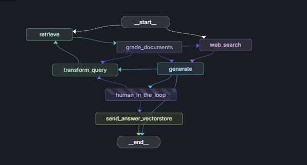

# Aegis  

## Overview  
**Aegis** is an **Adaptive Corrective Agentic RAG (Retrieval-Augmented Generation)** backend for intelligent API services.  
It features an adaptive, corrective approach to RAG, leveraging modular Python frameworks and graph-based orchestration for scalable, robust language model applications. 
[](https://fastapi.tiangolo.com)
[](https://www.langchain.com)
[](https://www.langgraph.dev)
[](https://www.datastax.com)
[](https://www.groq.com)


## Main Features  
- Modular codebase with clear separation of concerns  
- RESTful API endpoints  
- Database integration  
- Embedding, retrieval, and grading chains for advanced data processing  

## Adaptive Corrective RAG  
Aegis implements an **adaptive corrective RAG pipeline**, which dynamically refines and corrects responses from language models using feedback and grading mechanisms.  
The system adapts to user queries and context, improving accuracy and relevance over time.  

## Frameworks & Libraries  
- **FastAPI** – High-performance web framework for building APIs  
- **LangChain** – Framework for building language model-powered applications  
- **Pydantic** – Data validation and settings management  
- **SQLAlchemy** – Database ORM  
- **Other** – Custom utility modules, graph builders, and retrievers  

## Structure  
- `app.py`, `main.py` – Entry points for the application  
- `Backend/` – API routers, schemas, and database logic  
- `src/` – Chains, embeddings, graphs, nodes, retrievers, states, web search  
- `utils/` – Document uploaders and helpers  

## Getting Started

### Install dependencies
```bash
pip install -r requirements.txt
```

### Run the app
```bash
python app.py
```

## Graph Architecture Explained
The Adaptive Corrective RAG workflow consists of the following components:




- **__start__** – Entry point for user queries
- **Retrieve Phase (`retrieve`)** – Fetches documents from the vector store. If retrieval is insufficient, the pipeline adapts
- **Quality Check (`grade_documents`)** – Evaluates whether retrieved documents are relevant and useful. If documents are poor, the pipeline shifts strategy
- **Fallback Search (`web_search`)** – If local retrieval fails, a web search is triggered as a corrective measure
- **Query Adaptation (`transform_query`)** – Reformulates or expands the query to improve retrieval. Ensures the system adapts when results are weak
- **Answer Generation (`generate`)** – Produces an initial draft answer using the retrieved (or web-searched) context
- **Human-in-the-Loop (`human_in_the_loop`)** – Optional correction stage where a human can review or refine the generated answer. Provides safety and quality control
- **Answer Validation & Storage (`send_answer_vectorstore`)** – Final validated answers are stored back into the vector store for future reuse and continuous improvement
- **__end__** – Marks the conclusion of the pipeline, delivering the refined response to the user

### Workflow Diagram (Textual Representation)

```
 START
   │
   ▼
 route_question
   ├── web_search ──▶ generate ──▶ grade_generation
   └── retrieve ──▶ grade_documents ──▶ (generate | web_search | transform_query)
                                               │
                                               ▼
                                      transform_query ──▶ retrieve

 grade_generation
   ├── not supported ──▶ END
   ├── useful_websearch ──▶ human_in_the_loop ──▶ (yes → send_answer_vectorstore → END | no → transform_query)
   ├── useful_vectorstore ──▶ END
   └── not useful ──▶ transform_query
```
### Detailed Flow

#### 1. Start
The system begins with `route_question`, deciding whether to:
- Answer using web search → goes to `web_search`
- Answer using the vector store → goes to `retrieve`

#### 2. Web Search vs Retrieval
- If web search, results go directly to `generate`
- If retrieval, results go to `grade_documents` for quality checking

#### 3. After Document Grading
- If docs are good → go to `generate`
- If docs are poor → fallback to `web_search`
- If query is unclear → reformulate with `transform_query` → loop back to `retrieve`

#### 4. After Generating an Answer
- If answer is unsupported or hallucinated → END
- If answer is useful (web search) → pass through `human_in_the_loop`
- If answer is useful (vectorstore) → END
- If answer is not useful → retry with `transform_query`

#### 5. Human-in-the-Loop Feedback
- **Yes** → store validated answer via `send_answer_vectorstore` → END
- **No** → retry via `transform_query`

### Key Concepts

- **Adaptive**: Chooses best route (vectorstore, web search, or reformulation)
- **Corrective**: Fixes bad answers through retries or human review
- **Safe**: Prevents infinite loops by ending on hallucinations or unsupported answers

---

*For more details, see the code comments and individual module documentation.*